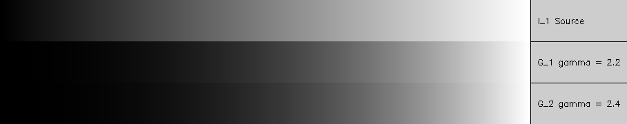

## Работа 1. Исследование гамма-коррекции
автор: Голованов Н.С.
дата: 2021-02-24T10:37:46

<!-- url: https://gitlab.com/2021-misis-spring/polevoy_d_v/-/tree/master/prj.labs/lab01 -->

### Задание
1. Сгенерировать серое тестовое изображение $I_1$ в виде прямоугольника размером 768х60 пикселя с плавным изменение пикселей от черного к белому, одна градация серого занимает 3 пикселя по горизонтали.
2. Применить  к изображению $I_1$ гамма-коррекцию с коэффициентом из интервала 2.2-2.4 и получить изображение $G_1$ при помощи функци pow.
3. Применить  к изображению $I_1$ гамма-коррекцию с коэффициентом из интервала 2.2-2.4 и получить изображение $G_2$ при помощи прямого обращения к пикселям.
4. Показать визуализацию результатов в виде одного изображения (сверху вниз $I_1$, $G_1$, $G_2$).
5. Сделать замер времени обработки изображений в п.2 и п.3, результаты отфиксировать в отчете.

### Результаты


Рис. 1. Результаты работы программы (сверху вниз $I_1$, $G_1$, $G_2$)

### Текст программы

```cpp
#include <opencv2/opencv.hpp>
#include <chrono>
#include <opencv2/imgproc.hpp>
int main() {
  cv::Mat img(cv::Mat::zeros(60, 768, CV_8UC1));
  
  // Generate img
  int mult = 3;
  for (size_t i = 0; i < 256; i++) {
	  cv::Point p1(i * mult, 0);
	  cv::Point p2((i+1) * mult, 60);
	  cv::rectangle(img, p1, p2, i, -1);
  }

  double gamma1 = 2.2;
  cv::Mat G_1;
  cv::cvtColor(img, G_1, CV_32FC1);
  cv::normalize(img, G_1, 1.0, 0.0, cv::NORM_MINMAX, CV_32FC1);

  auto e1 = cv::getTickCount();
  auto t_start1 = std::chrono::high_resolution_clock::now();
  cv::pow(G_1, gamma1, G_1);
  auto t_finish1 = std::chrono::high_resolution_clock::now();
  auto e2 = cv::getTickCount();
  auto E1 = (e2 - e1) / cv::getTickFrequency();
  auto time_1 = std::chrono::duration_cast<std::chrono::duration<double>> (t_finish1 - t_start1);
  std::cout << "Time for cv::pow() via chrono " << time_1.count() << std::endl;
  std::cout << "Time for cv::pow() via cv::getTickCount " << E1 << std::endl;
  cv::normalize(G_1, G_1, 255, 0, cv::NORM_MINMAX, CV_8UC1); //convert to CV_8UC1 with normalize
  //cv::imshow("G_1", G_1);

  float gamma2 = 2.4;
  cv::Mat G_2(cv::Mat::zeros(60, 768, CV_32FC1));
  auto t_start2 = std::chrono::high_resolution_clock::now();
  auto e3 = cv::getTickCount();
  for (size_t i = 0; i < 256; i++)
  {
	  int pos = i * mult;
	  float correction = pow(float(img.at<uchar>(0, pos)), gamma2);
	  for (size_t j = 0; j < img.rows; j++)
	  {
		  G_2.at<float>(j, pos)		= correction;
		  G_2.at<float>(j, pos + 1) = correction;
		  G_2.at<float>(j, pos + 2) = correction;
	  }
  }
  auto t_finish2 = std::chrono::high_resolution_clock::now();
  auto e4 = cv::getTickCount();
  auto E2 = (e4 - e3) / cv::getTickFrequency();
  auto time_span2 = std::chrono::duration_cast<std::chrono::duration<double>> (t_finish2 - t_start2);
  std::cout << "Time for per pixel pow() via chrono " << time_span2.count() << std::endl;
  std::cout << "Time for per pixel pow() cv::getTickCount() " << E2 << std::endl;
  cv::normalize(G_2, G_2, 255, 0, cv::NORM_MINMAX, CV_8UC1);
  //cv::imshow("G_2", G_2);
  //cv::imshow("G_2_norm", G_2);
  //cv::waitKey();

  cv::Mat matRes(img.rows * 3, img.cols + 140, img.type());
  cv::Mat matRoi = matRes(cv::Rect(0, 0, img.cols, img.rows));
  img.copyTo(matRoi);
  matRoi = matRes(cv::Rect(0, img.rows, img.cols, img.rows));
  G_1.copyTo(matRoi);
  matRoi = matRes(cv::Rect(0, img.rows*2, img.cols, img.rows));
  G_2.copyTo(matRoi);

  cv::line(matRes, cv::Point(img.cols, 0), cv::Point(img.cols, img.rows * 3), 0, 1);
  cv::line(matRes, cv::Point(img.cols, img.rows), cv::Point(img.cols+140, img.rows ), 0, 1);
  cv::line(matRes, cv::Point(img.cols, img.rows*2), cv::Point(img.cols + 140, img.rows*2), 0, 1);
  cv::String text  = "$I_1$ Source";
  cv::String text1 = "$G_1$ gamma = 2.2";
  cv::String text2 = "$G_2$ gamma = 2.4";
  int fontFace = cv::FONT_HERSHEY_SIMPLEX;
  double fontScale = 0.4;
  int thickness = 1;
  int baseline = 0;
  cv::Size textSize = cv::getTextSize(text, fontFace, fontScale, thickness, &baseline);
  cv::Point textOrg((img.cols + 10),(img.rows + textSize.height) / 2);
  cv::Point textOrg1((img.cols + 10), img.rows + ((img.rows + textSize.height) / 2));
  cv::Point textOrg2((img.cols + 10), img.rows*2 + ((img.rows + textSize.height) / 2));
  cv::putText(matRes, text, textOrg, fontFace, fontScale, 0, thickness, 8);
  cv::putText(matRes, text1, textOrg1, fontFace, fontScale, 0, thickness, 8);
  cv::putText(matRes, text2, textOrg2, fontFace, fontScale, 0, thickness, 8);

  // save result
  cv::imshow("res", matRes);
  cv::imwrite("lab01.png", matRes);
  cv::waitKey();
}

