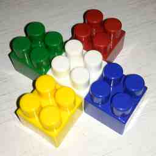
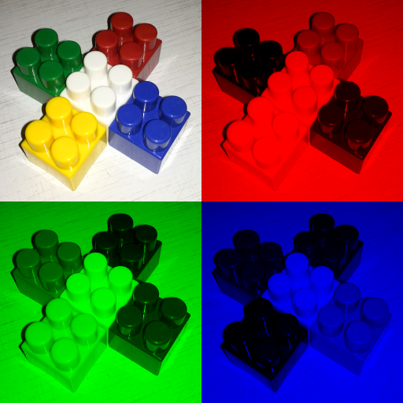
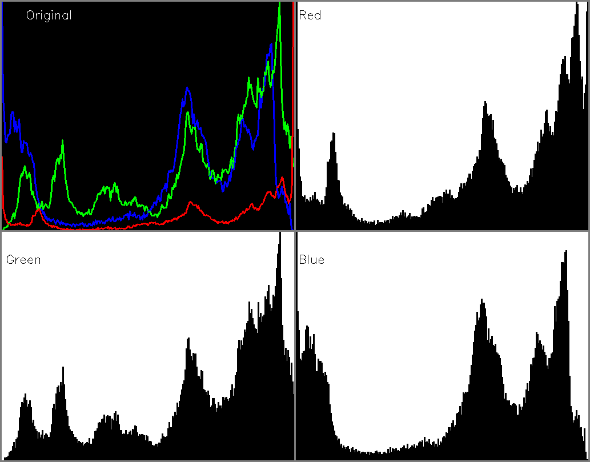
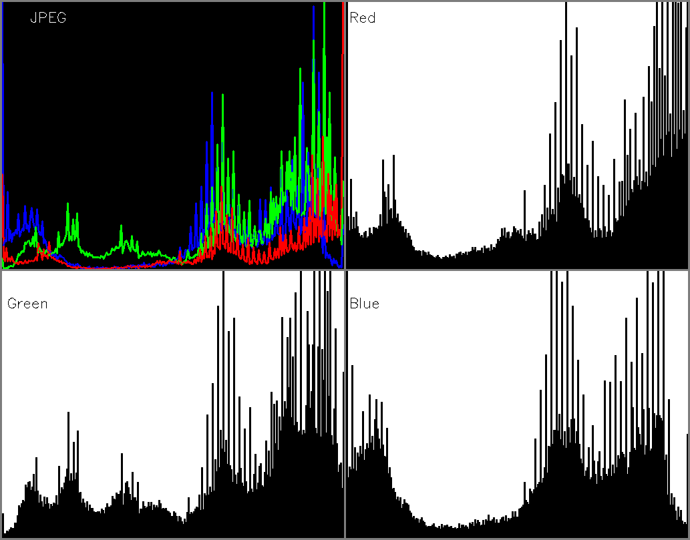

## Работа 2. Исследование каналов и JPEG-сжатия
автор: Голованов Н.С.
дата: 2021-03-05T17:58:22

Репозиторий на [SVN](https://mysvn.ru/mozgolom112/CV/)
Репозиторий на [GitHub](https://github.com/mozgolom112/CV)

### Задание
1. В качестве тестового использовать изображение data/cross_0256x0256.png
2. Сохранить тестовое изображение в формате JPEG с качеством 25%.
3. Используя cv::merge и cv::split сделать "мозаику" с визуализацией каналов для исходного тестового изображения и JPEG-версии тестового изображения
- левый верхний - трехканальное изображение
- левый нижний - монохромная (черно-зеленая) визуализация канала G
- правый верхний - монохромная (черно-красная) визуализация канала R
- правый нижний - монохромная (черно-синяя) визуализация канала B
4. Результы сохранить для вставки в отчет
5. Сделать мозаику из визуализации гистограммы для исходного тестового изображения и JPEG-версии тестового изображения, сохранить для вставки в отчет.

### Результаты


Рис. 1. Тестовое изображение после сохранения в формате JPEG с качеством 25%


Рис. 2. Визуализация каналов исходного тестового изображения


Рис. 3. Визуализация каналов JPEG-версии тестового изображения


Рис. 4. Визуализация гистограм исходного тестового изображения


Рис. 5. Визуализация гистограм JPEG-версии тестового изображения

### Текст программы

```cpp
#include <opencv2/opencv.hpp>

void SplitColorsAndSaveResult(cv::Mat& img, std::string path_to_file) {
	//Split in 3 channel
	cv::Mat bgrchannnels[3];
	cv::split(img, bgrchannnels);

	cv::Mat zeros, red_channel_img;
	
	zeros = cv::Mat::zeros(cv::Size(img.cols, img.rows), CV_8UC1);
	std::vector<cv::Mat> channels;
	channels.push_back(zeros);
	channels.push_back(zeros);
	channels.push_back(bgrchannnels[2]);
	// Merge the three channels
	cv::merge(channels, red_channel_img);
	channels.clear();

	//Same actions for green...
	cv::Mat green_channel_img;
	channels.push_back(zeros);
	channels.push_back(bgrchannnels[1]);
	channels.push_back(zeros);
	cv::merge(channels, green_channel_img);
	channels.clear();
	
	//... and blue colors
	cv::Mat blue_channel_img;
	channels.push_back(bgrchannnels[0]);
	channels.push_back(zeros);
	channels.push_back(zeros);
	cv::merge(channels, blue_channel_img);
	
	channels.clear();
	~zeros;
	//cv::namedWindow("Red", 1);
	//cv::imshow("Red", red_channel_img);
	//
	//cv::namedWindow("Green", 1);
	//cv::imshow("Green", green_channel_img);

	//cv::namedWindow("Blue", 1);
	//cv::imshow("Blue", blue_channel_img);
	//cv::waitKey();

	cv::Mat img_split_res(cv::Size(img.cols * 2, img.rows * 2), img.type());
	cv::Mat matRoi = img_split_res(cv::Rect(0, 0, img.cols, img.rows));
	img.copyTo(matRoi);
	matRoi = img_split_res(cv::Rect(img.cols, 0, img.cols, img.rows));
	red_channel_img.copyTo(matRoi);
	matRoi = img_split_res(cv::Rect(0, img.rows, img.cols, img.rows));
	green_channel_img.copyTo(matRoi);
	matRoi = img_split_res(cv::Rect(img.cols, img.rows, img.cols, img.rows));
	blue_channel_img.copyTo(matRoi);

	cv::imwrite(path_to_file, img_split_res);
}

void BuildHistAndSave(cv::Mat& img, std::string path_to_file, std::string draw_name) {
	//Split in 3 channel
	cv::Mat bgrchannnels[3];
	cv::split(img, bgrchannnels);

	std::vector<uint> red_brightness(256, 0);
	std::vector<uint> green_brightness(256, 0);
	std::vector<uint> blue_brightness(256, 0);

	for (size_t i = 0; i < img.cols; i++)
	{
		for (size_t j = 0; j < img.rows; j++){
			
			int rb = bgrchannnels[2].at<uchar>(j, i);
			int gb = bgrchannnels[1].at<uchar>(j, i);
			int bb = bgrchannnels[0].at<uchar>(j, i);
			red_brightness.at(rb) += 1;
			green_brightness.at(gb) += 1;
			blue_brightness.at(bb) += 1;
		}
	}

	int hist_w = 512, hist_h = 400;

	cv::Mat histRed(cv::Size(hist_w, hist_h), CV_8UC3, cv::Scalar(255, 255, 255));
	cv::Mat histGreen(cv::Size(hist_w, hist_h), CV_8UC3, cv::Scalar(255, 255, 255));
	cv::Mat histBlue(cv::Size(hist_w, hist_h), CV_8UC3, cv::Scalar(255, 255, 255));

	int pixel_amount = img.cols * img.rows;

	for (size_t i = 0; i < red_brightness.size(); i++) {
		int alt = int(float(red_brightness[i]) * hist_h * 70 / pixel_amount);
		cv::Point p1(i * 2, hist_h - alt);
		cv::Point p2((i + 1) * 2, hist_h);
		cv::rectangle(histRed, p1, p2, cv::Scalar(0, 0, 0), -1);
	}

	for (size_t i = 0; i < blue_brightness.size(); i++) {
		int alt = int(float(blue_brightness[i]) * hist_h * 70 / pixel_amount);
		cv::Point p1(i * 2, hist_h - alt);
		cv::Point p2((i + 1) * 2, hist_h);
		cv::rectangle(histBlue, p1, p2, cv::Scalar(0, 0, 0), -1);
	}

	for (size_t i = 0; i < green_brightness.size(); i++) {
		int alt = int(float(green_brightness[i]) * hist_h * 70 / pixel_amount); //set *70 for making it bigger
		cv::Point p1(i * 2, hist_h - alt);
		cv::Point p2((i + 1) * 2, hist_h);
		cv::rectangle(histGreen, p1, p2, cv::Scalar(0, 0, 0), -1);
	}

	/*cv::imshow("r", histRed);
	cv::imshow("b", histBlue);
	cv::imshow("g", histGreen);*/
	
	//steel from opencv doc and examples
	int histSize = 256;
	float range[] = { 0, 256 }; 
	const float* histRange = { range };
	bool uniform = true, accumulate = false;
	cv::Mat b_hist, g_hist, r_hist;
	cv::calcHist(&bgrchannnels[0], 1, 0, cv::Mat(), b_hist, 1, &histSize, &histRange, uniform, accumulate);
	cv::calcHist(&bgrchannnels[1], 1, 0, cv::Mat(), g_hist, 1, &histSize, &histRange, uniform, accumulate);
	cv::calcHist(&bgrchannnels[2], 1, 0, cv::Mat(), r_hist, 1, &histSize, &histRange, uniform, accumulate);
	
	int bin_w = cvRound((double)hist_w / histSize);
	cv::Mat histImage(hist_h, hist_w, CV_8UC3, cv::Scalar(0, 0, 0));
	cv::normalize(b_hist, b_hist, 0, histImage.rows, cv::NORM_MINMAX, -1, cv::Mat());
	cv::normalize(g_hist, g_hist, 0, histImage.rows, cv::NORM_MINMAX, -1, cv::Mat());
	cv::normalize(r_hist, r_hist, 0, histImage.rows, cv::NORM_MINMAX, -1, cv::Mat());
	for (int i = 1; i < histSize; i++)
	{
		cv::line(histImage, cv::Point(bin_w * (i - 1), hist_h - cvRound(b_hist.at<float>(i - 1))),
			cv::Point(bin_w * (i), hist_h - cvRound(b_hist.at<float>(i))),
			cv::Scalar(255, 0, 0), 2, 8, 0);
		cv::line(histImage, cv::Point(bin_w * (i - 1), hist_h - cvRound(g_hist.at<float>(i - 1))),
			cv::Point(bin_w * (i), hist_h - cvRound(g_hist.at<float>(i))),
			cv::Scalar(0, 255, 0), 2, 8, 0);
		cv::line(histImage, cv::Point(bin_w * (i - 1), hist_h - cvRound(r_hist.at<float>(i - 1))),
			cv::Point(bin_w * (i), hist_h - cvRound(r_hist.at<float>(i))),
			cv::Scalar(0, 0, 255), 2, 8, 0);
	}
	cv::imshow("calcHist Demo", histImage);


	cv::Mat histRes(cv::Size(histImage.cols * 2 + 9, histImage.rows * 2 + 9), histImage.type(), cv::Scalar(125, 125, 125));
	cv::Mat matRoi = histRes(cv::Rect(3, 3, histImage.cols, histImage.rows));
	histImage.copyTo(matRoi);
	matRoi = histRes(cv::Rect(histImage.cols + 6, 3, histImage.cols, histImage.rows));
	histRed.copyTo(matRoi);
	matRoi = histRes(cv::Rect(3, histImage.rows + 6, histImage.cols, histImage.rows));
	histGreen.copyTo(matRoi);
	matRoi = histRes(cv::Rect(histImage.cols + 6, histImage.rows + 6, histImage.cols, histImage.rows));
	histBlue.copyTo(matRoi);


	cv::String text = "Red";
	cv::String text1 = "Green";
	cv::String text2 = "Blue";
	cv::String text3 = draw_name;
	int fontFace = cv::FONT_HERSHEY_SIMPLEX;
	double fontScale = 0.7;
	int thickness = 1;
	int baseline = 0;
	cv::Size textSize = cv::getTextSize(text, fontFace, fontScale, thickness, &baseline);
	cv::Point textOrg((histImage.cols + 10), (textSize.height + 35 / 2));
	cv::Point textOrg1((10), ((histImage.rows  + textSize.height + 45)) );
	cv::Point textOrg2((histImage.cols + 10), ((histImage.rows  + textSize.height + 45)));
	cv::Point textOrg3((45), (textSize.height + 35 / 2));
	cv::putText(histRes, text, textOrg, fontFace, fontScale, 0, thickness, 8);
	cv::putText(histRes, text1, textOrg1, fontFace, fontScale, 0, thickness, 8);
	cv::putText(histRes, text2, textOrg2, fontFace, fontScale, 0, thickness, 8);
	cv::putText(histRes, text3, textOrg3, fontFace, fontScale, cv::Scalar(255, 255, 255), thickness, 8);
	cv::imshow("histRes", histRes);
	cv::waitKey();
	cv::imwrite(path_to_file, histRes);
	printf("r");

}

int main() {
	cv::Mat img = cv::imread("./cross_0256x0256.png");

	BuildHistAndSave(img, "./cross_0256x0256_hists.png","Original");
	SplitColorsAndSaveResult(img, "./cross_0256x0256_png_channels.png");

	//Save as jpeg with 25% of quality
	std::vector<int> wr_params;
	wr_params.push_back(cv::IMWRITE_JPEG_QUALITY);
	wr_params.push_back(25);
	cv::imwrite("./cross_0256x0256_025.jpg", img, wr_params);
	//Read img again
	cv::Mat img_jpg = cv::imread("./cross.jpeg", cv::IMREAD_COLOR);
	SplitColorsAndSaveResult(img_jpg, "./cross_0256x0256_jpg_channels.png");
	BuildHistAndSave(img_jpg, "./cross_0256x0256_jpg_hists.png", "JPEG");


}
```
